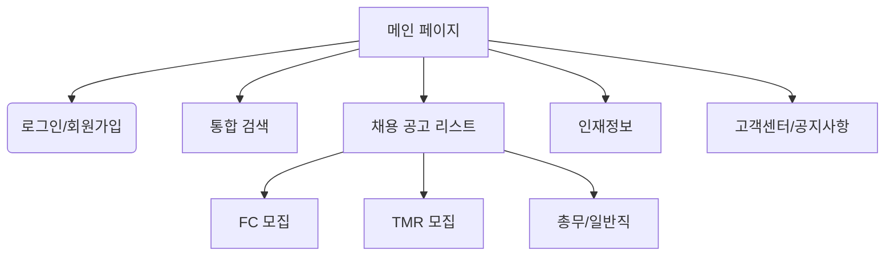

# Insumatch 클론 코딩 개발 플랜

## 1. 프로젝트 개요
**목표:** 보험 전문 채용 사이트 'Insumatch'의 메인 페이지 및 핵심 기능을 클론 코딩하여 웹 서비스 구축
**핵심 가치:** 보험 업계 특화(FC, TMR, 총무 등)된 직관적인 채용 정보 제공

## 2. 상세 기능 명세 (Functional Specifications)

사용자 님의 요청에 따라, 보험 업계의 특성과 'Insumatch' 사이트의 구조를 분석하여 구체적인 기능 명세를 정의했습니다.

### 2.1. 모집 분야 정의
사이트 상단 네비게이션(GNB)에 위치한 핵심 카테고리에 대한 정의입니다.

*   **FC 모집 (Financial Consultant)**
    *   **정의:** 재무설계사, 보험설계사 모집. 주로 대면 영업을 기반으로 하며, 고객을 직접 만나 재무 상담 및 보험 상품을 제안하는 직군입니다.
    *   **주요 기재 항목:** 소속 지점(GA/원수사), 수수료율(Commission), 정착 지원금 여부, 교육 시스템, DB 제공 여부.
*   **TMR 모집 (Tele Marketing Representative)**
    *   **정의:** 전화 영업(TM) 모집. 사무실 내에서 전화를 통해 보험 상품을 상담하고 판매하는 직군입니다.
    *   **주요 기재 항목:** 인바운드/아웃바운드 구분, 기본급 유무, 인센티브 구조, 근무지(센터 위치), 근무 시간.
*   **총무/일반직 모집**
    *   **정의:** 보험 대리점(GA) 또는 지점의 행정 지원, 계약 관리, 전산 입력 등을 담당하는 내근직입니다.
    *   **주요 기재 항목:** 사용 가능한 전산(원수사 전산 등), 경력 연수, 급여(월급제), 4대 보험 적용 여부.
*   **인재정보**
    *   **정의:** 구직자(개인 회원)가 자신의 이력서를 등록해두면, 기업 회원이 열람할 수 있는 공간입니다.
    *   **기능:** 이력서 등록/수정, 열람 제안 받기, 비공개 설정.

### 2.2. 채용 공고 등급 시스템 (Listing Hierarchy)
메인 화면 스크린샷에 나타난 공고 노출 방식에 따른 등급 구분입니다.

1.  **프리미엄 채용정보 (Premium Listings)**
    *   **위치:** 메인 페이지 최상단
    *   **특징:** 가장 큰 배너 형태, 로고 강조, 배경 이미지 사용 가능. 높은 주목도.
    *   **데이터:** 기업 로고, 큰 제목, 강조 문구, 태그(예: #정착지원금 #DB제공).
2.  **우대 채용정보 (Special Listings)**
    *   **위치:** 프리미엄 하단
    *   **특징:** 프리미엄보다 작지만 일반 공고보다 상위에 노출. 리스트 형태이나 테두리나 아이콘으로 강조.
3.  **일반 채용정보 (General Listings)**
    *   **위치:** 하단 그리드 영역
    *   **특징:** 카드 형태의 그리드 배치. 기업명, 공고 제목, 간단한 설명만 노출.

### 2.3. 검색 및 필터링 (Search & Filter)
*   **지역 선택:** 시/도 > 구/군 단위의 계층적 선택 (예: 서울 > 강남구).
*   **직종 선택:** FC, TMR, 총무, 지점장 등 직군 필터링.
*   **키워드 검색:** 기업명 또는 공고 제목 검색.

### 2.4. 회원 시스템 (User Types)
*   **개인 회원 (구직자):** 이력서 등록, 채용 공고 스크랩, 지원하기.
*   **기업 회원 (구인자):** 채용 공고 등록/수정/삭제(CRUD), 공고 등급 결제(Simulation), 인재정보 열람.

---

## 3. 사이트 구조 (Sitemap)

---

## 4. 기술 스택 (Tech Stack)

*   **Frontend Framework:** Next.js 14 (App Router)
    *   *이유:* SEO 최적화(채용 사이트 필수), 서버 사이드 렌더링(SSR)을 통한 빠른 초기 로딩.
*   **Language:** TypeScript
    *   *이유:* 채용 공고 데이터(Interface)의 복잡성을 관리하기 위해 정적 타입 시스템 필수.
*   **Styling:** Tailwind CSS
    *   *이유:* 스크린샷의 레이아웃을 빠르게 구현하고 반응형 디자인을 쉽게 적용.
*   **State Management:** React Context API (간단한 전역 상태), TanStack Query (서버 상태 관리).
*   **UI Components:** Shadcn/UI (Radix UI 기반) 또는 Headless UI.
*   **Icons:** Lucide React.

---

## 5. 개발 로드맵 (Development Roadmap)

### Phase 1: 프로젝트 초기화 및 기본 UI 구조 (Current)
*   [ ] Next.js + TypeScript + Tailwind CSS 프로젝트 생성
*   [ ] `layout.tsx` 구현 (Header, Footer, Navigation)
*   [ ] 폰트 및 글로벌 스타일 설정

### Phase 2: 메인 페이지 컴포넌트 개발
*   [ ] **Hero Section:** 배경 이미지 및 검색 필터 UI 구현
*   [ ] **Listing Components:**
    *   `PremiumJobCard`: 프리미엄 공고 컴포넌트
    *   `SpecialJobCard`: 우대 공고 컴포넌트
    *   `GeneralJobCard`: 일반 공고 카드 컴포넌트
*   [ ] **Notice & Customer Center:** 하단 정보 영역 구현

### Phase 3: 데이터 구조화 및 목업(Mock) 데이터 연결
*   [ ] Job Listing Interface 정의 (FC, TMR 등 타입 구분 포함)
*   [ ] Mock Data 생성 (스크린샷에 있는 삼성화재, 한화라이프랩 등 예시 데이터)
*   [ ] 메인 페이지에 Mock Data 매핑 및 렌더링

### Phase 4: 반응형 및 디테일 작업
*   [ ] 모바일 뷰 대응 (햄버거 메뉴, 그리드 레이아웃 조정)
*   [ ] Hover 효과 및 인터랙션 추가
*   [ ] 최종 검수
